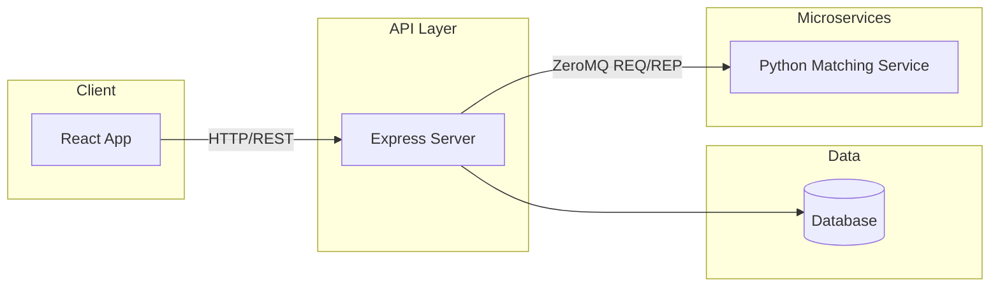
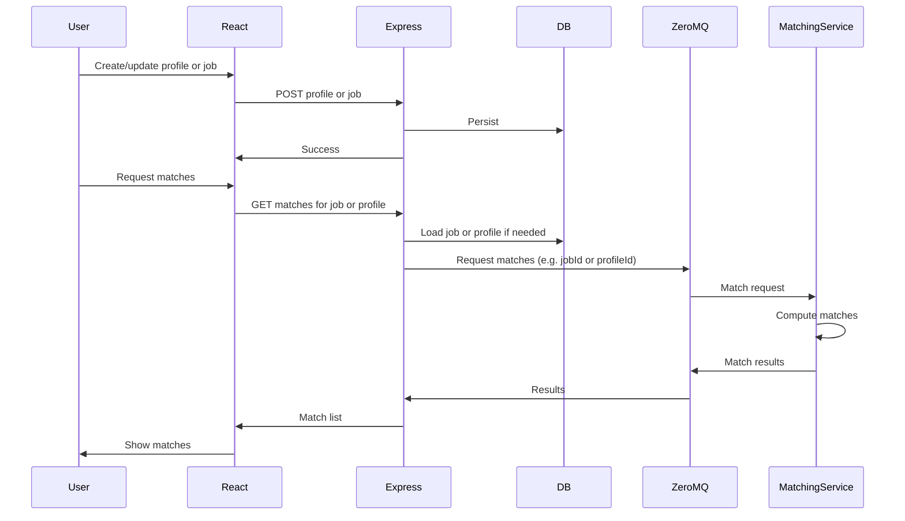

# Architecture

This document describes the system design, data flow, and technical decisions for the candidate–job matching application.

---

## High-Level Architecture



| Component | Responsibility |
|-----------|----------------|
| **React App** | UI for job seekers and recruiters: login, profiles, job listings, match browsing. Sends HTTP requests to Express; stores JWT and role for auth. |
| **Express Server** | REST API, auth (register/login, JWT validation), persistence (users, profiles, jobs). Forwards match requests to Python via ZeroMQ and returns results. |
| **Database** | Stores users (with role), job seeker profiles, job listings. Optionally caches match metadata; raw match lists can be computed on demand by the matching service. |
| **Python Matching Service** | Receives match requests over ZeroMQ (e.g. by job ID or profile ID), runs matching logic, returns ranked candidates or jobs. Stateless; reads criteria from the request or from data sent by Express. |

---

## Auth and Roles

- **Login:** One login endpoint (e.g. `POST /api/auth/login`) with body `{ email, password }`. Response includes a JWT and the user’s **role** (`job_seeker` or `recruiter`). No separate URLs for “recruiter login” vs “job seeker login”; the role in the token drives redirects and permissions.
- **Sessions:** Stateless JWT. Token payload includes at least `userId` and `role`. Express validates the JWT on protected routes via middleware and attaches `req.user` (id, role).
- **Role-based access:**
  - **Backend:** Middleware checks `req.user.role` before allowing access to role-specific resources (e.g. only recruiters can create jobs and see candidate matches; only job seekers can create profiles and see job matches).
  - **Frontend:** After login, redirect by role (e.g. job seeker → dashboard for profiles/matches, recruiter → dashboard for jobs/candidates). Route guards or a role-aware layout hide or disable links that don’t apply to the current role.

---

## Data Flow: Matching Pipeline



- **Stored in DB:** Users (credentials, role), job seeker profiles (skills, experience, preferences), job listings (title, requirements, etc.). These are created/updated via Express and never directly by the Python service.
- **Computed by microservice:** The list of matches (e.g. ranked job seekers for a job, or ranked jobs for a profile) and optional scores. The Python service receives identifiers and/or criteria over ZMQ and returns results; Express may optionally cache or persist them, but the source of truth for “how to match” is the service.

---

## ZeroMQ Integration

- **Pattern:** **REQ/REP** for simplicity: one Express process sends a request, one Python process replies. For higher load, a later step could introduce DEALER/ROUTER and multiple Python workers.
- **Roles:** Express is the **ZMQ client** (REQ socket); the Python matching service is the **ZMQ server** (REP socket). The Python process must be running and bound (e.g. `tcp://*:5555`) before Express sends requests.
- **Message shape:** JSON. Example request from Express to Python: `{ "type": "match_job", "jobId": "..." }` or `{ "type": "match_profile", "profileId": "..." }`. Response: `{ "matches": [ ... ], "error": null }` or `{ "matches": [], "error": "..." }`. Exact field names and payloads are defined in the implementation plan or API contract; this doc only states that the contract is JSON and request/response.
- **Port:** One port (e.g. `5555`) for the REP socket; configurable via env (e.g. `ZMQ_MATCHING_PORT` or `MATCHING_SERVICE_ENDPOINT`).

---

## Data Model (Conceptual)

| Entity | Purpose | Key fields (conceptual) |
|--------|---------|-------------------------|
| **User** | Auth and role | id, email, passwordHash, role (job_seeker \| recruiter), createdAt |
| **JobSeekerProfile** | One profile per job seeker (or one per user) | id, userId, name, skills, experience, preferences, createdAt, updatedAt |
| **JobListing** | One listing per recruiter | id, userId (recruiter), title, description, requirements, createdAt, updatedAt |
| **Match / MatchResult** | Optional cache of match output | Optional: jobId or profileId, list of matched ids and scores, computedAt. If not stored, matches are always computed on demand by the Python service. |

Relations: JobSeekerProfile belongs to User (job_seeker). JobListing belongs to User (recruiter). Matches are either derived at request time from profiles and jobs or stored as a cache table keyed by jobId/profileId.

---

## Folder Structure (Target)

```
361_Course_Project/
  docs/                    # This folder: ARCHITECTURE.md, IMPLEMENTATION_PLAN.md
  frontend/                # React app (e.g. Vite or CRA)
  backend/                 # Node.js Express API
  services/
    matching/              # Python ZeroMQ matching microservice
```

- **frontend:** React app with its own `package.json`, build, and dev server.
- **backend:** Express app with routes, middleware, DB access, and ZMQ client code.
- **services/matching:** Python project (e.g. `main.py` or `server.py`, `requirements.txt`), ZMQ REP server and matching logic.

No code or runtime scaffolding is implied in this architecture doc; see [IMPLEMENTATION_PLAN.md](IMPLEMENTATION_PLAN.md) for step-by-step setup.
